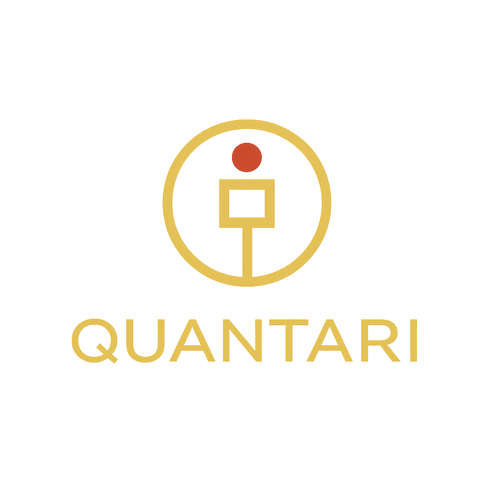

# Quantari (QNTR) — Solana Devnet Token

This repository contains all deployment scripts, configuration files, and logs related to the launch of **Quantari (QNTR)** — a testnet token developed to explore fair-launch models, community trust mechanics, and treasury-managed incentives on Solana.

---

## 🧬 Token Information

- **Name:** Quantari  
- **Symbol:** QNTR  
- **Mint Address:** 6djLsDWhcH8UkE87pB6ZrvYVEBGuNU7imHq7n3nD547N  
- **Mint Authority:** `88QejiCvjYF4D5pM6qJeZ9zf9eE7SsV3Sfp9BCiKYQpw` *(2-of-3 Multisig)*  
- **Initial Supply:** 1,000,000 QNTR  
- **Decimals:** 9  
- **Network:** Solana Devnet  

---

## 🎨 Brand Assets

| Asset Type     | Preview                                   | Download Link                         |
|----------------|-------------------------------------------|----------------------------------------|
| Logo (Light)   |                  | [Download](assets/logo.png)           |
| Logo (Dark)    |              | [Download](assets/logo_dark.png)      |
| Square Icon    |          | [Download](assets/logo_square.png)    |
| Favicon        | 🧠                                        | [favicon.ico](assets/favicon.ico)     |
| SVG Vector     | 📐                                        | [quantari.svg](assets/quantari.svg)   |
| Social Preview |         | [Download](assets/opengraph_banner.png) |

---

## 🔐 Security Summary

- ✅ **Mint authority** assigned to a 2-of-3 multisig
- ✅ Verified that original deployer cannot mint new tokens
- ⚠️ **Liquidity not locked** (devnet token for testing purposes)
- 📁 Deployment logs and authority transfers are archived in this repository

---

## 📈 Project Goals

Quantari is a sandbox initiative to:

- Model transparent token launches
- Test governance via multisig
- Build a public DApp for community access
- Pilot a reward/tier system based on wallet activity
- Enable future migration to mainnet (optional)

---

## 📂 Repository Structure

- `launch_token.sh` — Automated token deployment + minting script  
- `logs/` — Deployment & authority transfer logs  
- `metadata/` — Token metadata + assets for DApps and explorers  

---

> **Disclaimer:**  
> Quantari is a non-transferable test token on Solana Devnet, created for educational and experimental use only.  
> No association with any mainnet token or financial product.